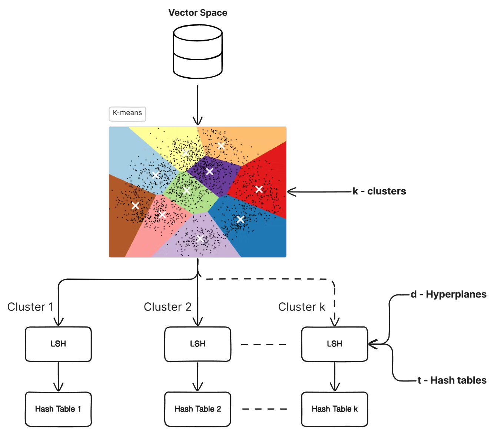

# Semantic Search Engine

## Overview
The **Semantic Search Engine** is a project aimed at designing and implementing an indexing system for a semantic search database. The system efficiently retrieves information based on vector space embeddings, focusing on an indexing mechanism specifically for a vector column.

## Project Objective
The objective of this project is to develop a scalable and efficient indexing system that leverages clustering and hashing techniques to improve the search performance of high-dimensional vector data.

## System Design
The indexing system is structured into two major layers:

### Training Phase
1. **K-means Clustering**
  - The vector space is divided into multiple (k) subspaces using K-means clustering.
  - This step significantly reduces the search space for a given query vector.

2. **Locality Sensitive Hashing (LSH)**
  - Each cluster undergoes a second splitting stage using LSH.
  - This further narrows down the search space, ensuring efficient retrieval.

### Evaluation Phase
The same methodology used in training is applied during the query evaluation. The process is broken down into three main steps:

1. **Nearest Cluster Prediction**
  - The system predicts the most relevant cluster for a given query vector.

2. **Query Hashing**
  - The query is hashed to locate the most relevant candidates within the cluster.

3. **Ranking Candidates**
  - The retrieved candidates are ranked based on their similarity to the query vector.

## License
This project is licensed under [MIT License](LICENSE).
